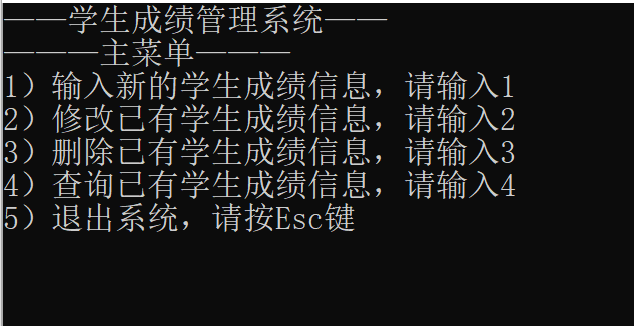
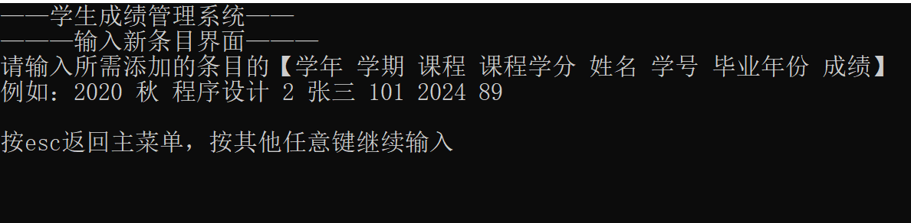
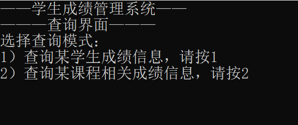
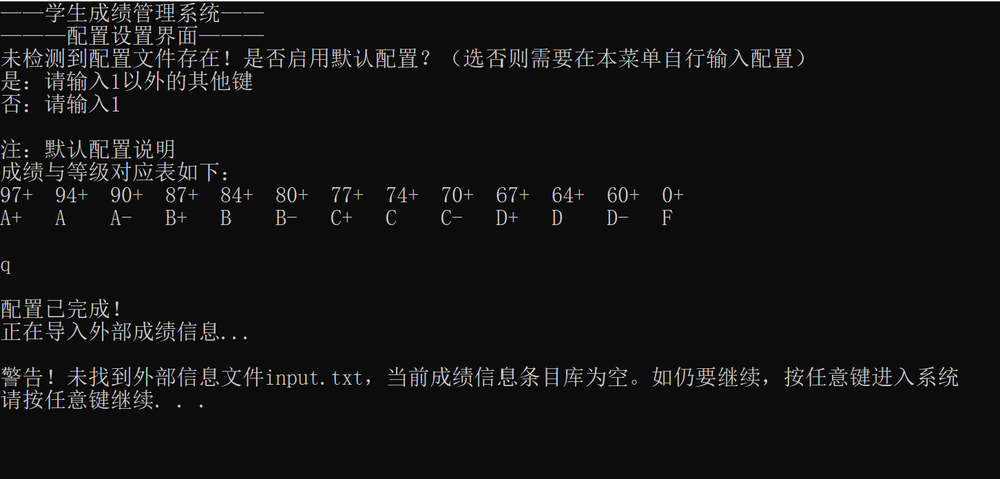

# 命令行界面程序——学生成绩管理系统

大一春季学期程序设计基础课C++大作业——学生管理系统。
可以算是是我的第一个较为成熟的OOP项目，封装性较好，所有功能均通过类来实现（虽然在我进一步学习OOP的思想之后再回来看，这个项目的过程化思想还是很浓厚的...）。在xfgg（[Timothy-LiuXuefeng](https://github.com/Timothy-LiuXuefeng)）的指导下应用了很多stl技术，从此一发不可收拾，走上了C++的不归路...

使用方法：在任意C++项目中，添加源文件，编译生成即可。

（release已发布，使用时input.txt与output.txt应在.exe所在目录下）

程序界面：

